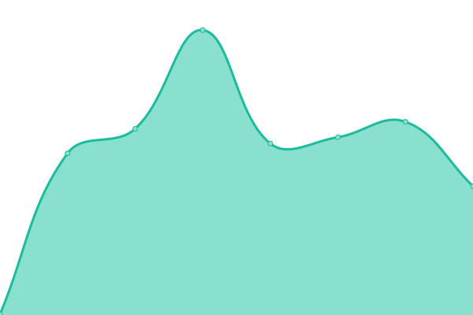
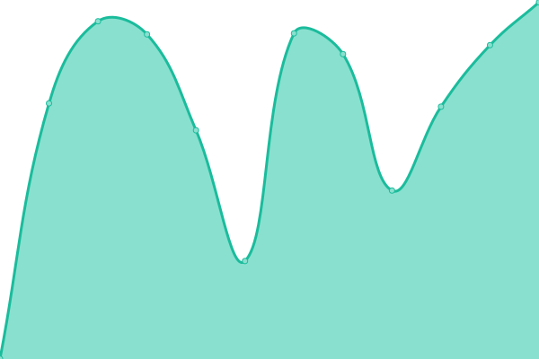
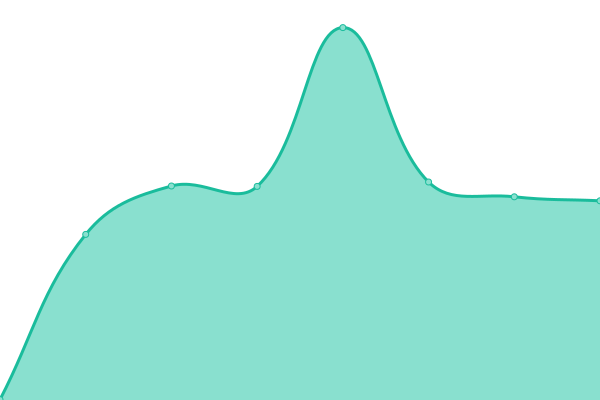
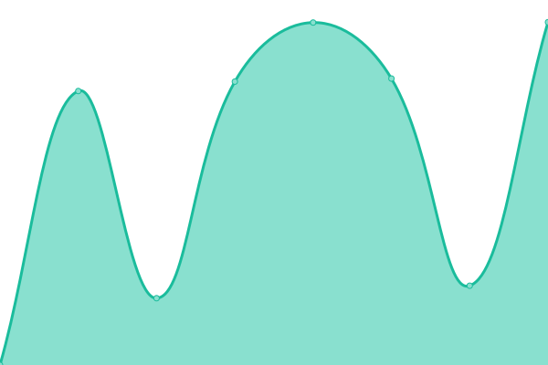

# [📈 Live Status](https://demo.upptime.js.org): <!--live status--> **🟩 All systems operational**

This repository contains the open-source uptime monitor and status page for [fabianbeier](https://demo.upptime.js.org), powered by [Upptime](https://github.com/upptime/upptime).

With [Upptime](https://upptime.js.org), you can get your own unlimited and free uptime monitor and status page, powered entirely by a GitHub repository. We use [Issues](https://github.com/fabianbeier/upptime/issues) as incident reports, [Actions](https://github.com/fabianbeier/upptime/actions) as uptime monitors, and [Pages](https://demo.upptime.js.org) for the status page.

<!--start: status pages-->
<!-- This summary is generated by Upptime (https://github.com/upptime/upptime) -->
<!-- Do not edit this manually, your changes will be overwritten -->
<!-- prettier-ignore -->
| URL | Status | History | Response Time | Uptime |
| --- | ------ | ------- | ------------- | ------ |
|  [Ich bin alles](https://www.ich-bin-alles.de) | 🟩 Up | [ich-bin-alles.yml](https://github.com/fabianbeier/upptime/commits/HEAD/history/ich-bin-alles.yml) | 

 720ms
     
 | 

<a href="https://fabianbeier.github.io/upptime/history/ich-bin-alles">100.00%</a>
    

|  [Fabian Beier](https://www.fabian-beier.de) | 🟩 Up | [fabian-beier.yml](https://github.com/fabianbeier/upptime/commits/HEAD/history/fabian-beier.yml) | 

 216ms
     
 | 

<a href="https://fabianbeier.github.io/upptime/history/fabian-beier">100.00%</a>
    

|  [Uwe Spannagel](https://www.uwespannagel.com) | 🟩 Up | [uwe-spannagel.yml](https://github.com/fabianbeier/upptime/commits/HEAD/history/uwe-spannagel.yml) | 

 1066ms
     
 | 

<a href="https://fabianbeier.github.io/upptime/history/uwe-spannagel">100.00%</a>
    

|  [Galerie Clement](https://www.galerie-clement.de) | 🟩 Up | [galerie-clement.yml](https://github.com/fabianbeier/upptime/commits/HEAD/history/galerie-clement.yml) | 

 1084ms
     
 | 

<a href="https://fabianbeier.github.io/upptime/history/galerie-clement">100.00%</a>
    

|  [Galerie Clement CMS](https://cms.galerie-clement.de/admin/login) | 🟩 Up | [galerie-clement-cms.yml](https://github.com/fabianbeier/upptime/commits/HEAD/history/galerie-clement-cms.yml) | 

 471ms
     
 | 

<a href="https://fabianbeier.github.io/upptime/history/galerie-clement-cms">100.00%</a>
    

|  [Leap CMS](https://cms.leapsociety.org/admin/login) | 🟩 Up | [leap-cms.yml](https://github.com/fabianbeier/upptime/commits/HEAD/history/leap-cms.yml) | 

 578ms
     
 | 

<a href="https://fabianbeier.github.io/upptime/history/leap-cms">100.00%</a>
    

|  [Dr Richter](https://www.institut-id.com) | 🟩 Up | [dr-richter.yml](https://github.com/fabianbeier/upptime/commits/HEAD/history/dr-richter.yml) | 

 1791ms
     
 | 

<a href="https://fabianbeier.github.io/upptime/history/dr-richter">100.00%</a>
    

<!--end: status pages-->

[**Visit our status website →**](https://demo.upptime.js.org)

## 📄 License

- Powered by: [Upptime](https://github.com/upptime/upptime)
- Code: [MIT](./LICENSE) © [fabianbeier](https://demo.upptime.js.org)
- Data in the `./history` directory: [Open Database License](https://opendatacommons.org/licenses/odbl/1-0/)
